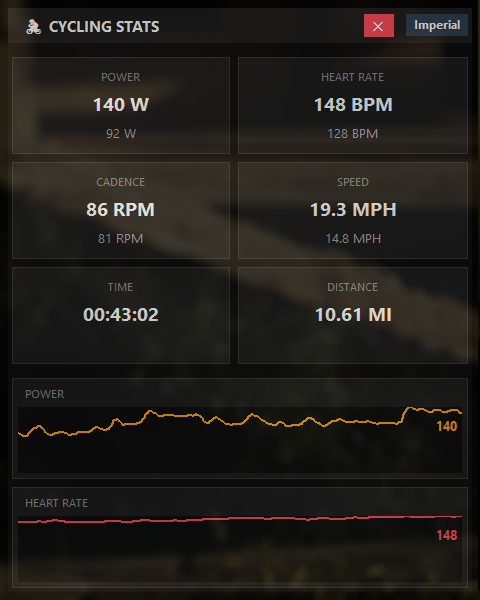

# Cycling Overlay

A draggable, always-on-top desktop overlay that displays live ride data — power,
heart rate, cadence, speed, distance, TSS, and calories — read from
[TPVirtual](https://www.tpvirtual.com/)'s `focus.json` broadcast file. Useful for
streaming or recording indoor rides with your stats visible on top of any window.



## Features

- Live-updating metric cards (power, heart rate, cadence, speed, distance, time, TSS, calories)
- Rolling power and heart rate graphs with a configurable time window
- Metric/imperial unit toggle
- Optional minimum cadence/power thresholds that flash red when you fall below them
- Semi-transparent, borderless, draggable window that stays on top of other apps
- Automatically refreshes as soon as TPVirtual writes new data (no polling)

## Requirements

- Windows (uses Tkinter; TPVirtual itself is Windows-only)
- Python 3.12+
- [uv](https://docs.astral.sh/uv/) for dependency management

## Installation

```
uv sync
```

## Usage

Start TPVirtual so it's writing to its `Broadcast/focus.json` file, then run:

```
uv run python -m cycling_overlay
```

The window is draggable from anywhere and can be closed with the ✕ button in the
header.

### Options

| Flag | Description |
| --- | --- |
| `--focus-file PATH` | Path to TPVirtual's `focus.json` (default: `~/Documents/TPVirtual/Broadcast/focus.json`) |
| `--min-cadence N` | Cadence turns red when pedaling below `N` rpm |
| `--min-power N` | Power turns red when below `N` watts |
| `--imperial` | Use mph/miles instead of km/h/km |
| `--hide-units` | Hide unit labels next to values |
| `--window-duration N` | Seconds of history kept in the graphs (default: 300) |

Example:

```
uv run python -m cycling_overlay --min-cadence 70 --min-power 150 --window-duration 600
```

## Testing without TPVirtual

`cycling_overlay.testdata` generates a stream of random ride data and writes it to
a `focus.json` file at the configured interval, so you can develop or demo the
overlay without TPVirtual running:

```
uv run python -m cycling_overlay.testdata
```

It defaults to the same path as the overlay; pass `--output` to point it elsewhere
and `--interval` to change how often it writes (default: 1 second).

## How it works

TPVirtual continuously overwrites a `focus.json` file with the current rider's
stats while broadcasting. This app watches that file for changes (via
[watchdog](https://pypi.org/project/watchdog/)) and re-renders the overlay each
time it's updated, rather than polling on a timer.

## Project layout

```
cycling_overlay/
├── __main__.py   # CLI entry point, logging setup
├── config.py     # CLI args, runtime config, layout/unit definitions
├── metrics.py    # Parses a focus.json rider entry and handles unit conversions
├── watcher.py    # Debounced filesystem watcher for focus.json
├── ui.py         # Tkinter overlay window
└── testdata.py   # Synthetic focus.json generator for testing
```

## Logs

Runtime logs are written to `cycling_overlay.log` in the project root (rotated
automatically at 5MB, keeping 3 backups) and are not checked into git.
