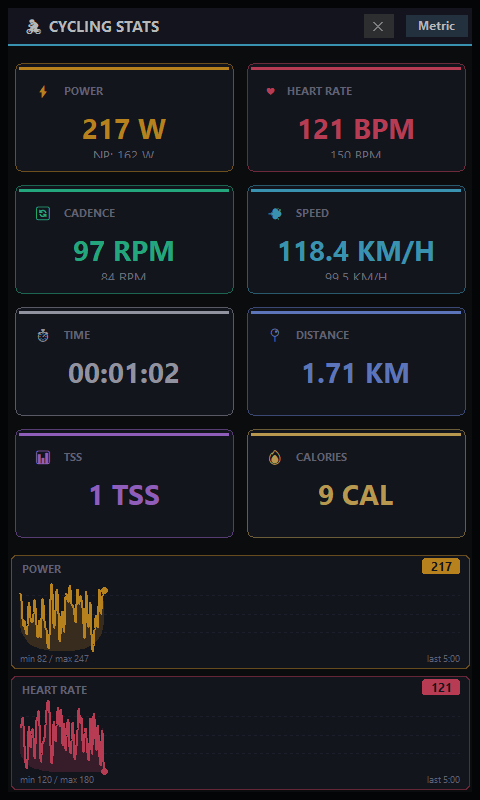

# Cycling Overlay

A draggable, always-on-top desktop overlay that displays live ride data — power,
heart rate, cadence, speed, distance, TSS, and calories — read from
[TrainingPeaks Virtual (TPVirtual)](https://www.trainingpeaks.com/virtual/#download)'s
`focus.json` broadcast file. Useful for streaming or recording indoor rides with
your stats visible on top of any window.



## Features

- Live-updating metric cards (power, heart rate, cadence, speed, distance, time, TSS, calories)
- Rolling power and heart rate graphs with a configurable time window
- Metric/imperial unit toggle
- Optional minimum cadence/power thresholds that flash red when you fall below them
- Semi-transparent, borderless, draggable window that stays on top of other apps
- Automatically refreshes as soon as TPVirtual writes new data (no polling)

## Requirements

Windows only (uses Tkinter; TPVirtual itself is Windows-only).

## Download (no Python required)

Grab the latest `TPVirtualOverlay.exe` from the
[Releases page](https://github.com/jordanallred/TP-Virtual-Overlay/releases/latest) —
it's a single self-contained executable, no install, no Python.

Windows SmartScreen may warn you about it since the executable isn't
code-signed; that's expected for a small open-source tool. Click
**More info → Run anyway** if you trust the source (or better yet, [read the
code](cycling_overlay) and build it yourself — see below).

1. Download `TPVirtualOverlay.exe`.
2. Start TPVirtual so it's writing to its `Broadcast/focus.json` file.
3. Double-click `TPVirtualOverlay.exe`.

The window is draggable from anywhere and can be closed with the ✕ button in the
header. There's no CLI on the packaged build, so it always runs with default
settings (metric units, no cadence/power thresholds); see below if you want
those options.

## For developers

### Requirements

- Python 3.12+
- [uv](https://docs.astral.sh/uv/) for dependency management

### Installation

```
uv sync
```

### Usage

Start TPVirtual so it's writing to its `Broadcast/focus.json` file, then run:

```
uv run python -m cycling_overlay
```

### Options

| Flag | Description |
| --- | --- |
| `--focus-file PATH` | Path to TPVirtual's `focus.json` (default: `~/Documents/TPVirtual/Broadcast/focus.json`) |
| `--min-cadence N` | Cadence turns red when pedaling below `N` rpm |
| `--min-power N` | Power turns red when below `N` watts |
| `--imperial` | Use mph/miles instead of km/h/km |
| `--hide-units` | Hide unit labels next to values |
| `--window-duration N` | Seconds of history kept in the graphs (default: 300) |

Example:

```
uv run python -m cycling_overlay --min-cadence 70 --min-power 150 --window-duration 600
```

## Testing without TPVirtual

`cycling_overlay.testdata` generates a stream of random ride data and writes it to
a `focus.json` file at the configured interval, so you can develop or demo the
overlay without TPVirtual running:

```
uv run python -m cycling_overlay.testdata
```

It defaults to the same path as the overlay; pass `--output` to point it elsewhere
and `--interval` to change how often it writes (default: 1 second).

## Building the executable yourself

The `.exe` on the [Releases page](https://github.com/jordanallred/TP-Virtual-Overlay/releases)
is built by [`.github/workflows/release.yml`](.github/workflows/release.yml) from
[`TPVirtualOverlay.spec`](TPVirtualOverlay.spec) whenever a `vX.Y.Z` tag is pushed.
To build the same thing locally:

```
uv sync --all-groups
uv run pyinstaller TPVirtualOverlay.spec --noconfirm --clean
```

The resulting `dist/TPVirtualOverlay.exe` is a onefile, windowed (no console)
build with the app icon embedded. Regenerate `assets/icon.ico` with
`uv run python scripts/make_icon.py` if you want to change it.

## How it works

TPVirtual continuously overwrites a `focus.json` file with the current rider's
stats while broadcasting. This app watches that file for changes (via
[watchdog](https://pypi.org/project/watchdog/)) and re-renders the overlay each
time it's updated, rather than polling on a timer.

## Project layout

```
cycling_overlay/
├── __main__.py       # Logging setup, main() entry point
├── config.py         # CLI args, runtime config, layout/unit definitions
├── metrics.py        # Parses a focus.json rider entry and handles unit conversions
├── watcher.py        # Debounced filesystem watcher for focus.json
├── ui.py             # Tkinter overlay window
└── testdata.py       # Synthetic focus.json generator for testing
run_overlay.py         # Entry script PyInstaller builds (imports cycling_overlay.__main__)
TPVirtualOverlay.spec  # PyInstaller build spec
assets/icon.ico        # App/window icon
scripts/make_icon.py   # Regenerates assets/icon.ico and assets/icon.png
.github/workflows/     # CI (lint) and release (build + publish exe on tag push)
```

## Logs

Runtime logs are written to `cycling_overlay.log` under
`%LOCALAPPDATA%\CyclingOverlay\` (rotated automatically at 5MB, keeping 3
backups). Check there first if the overlay isn't behaving as expected.
